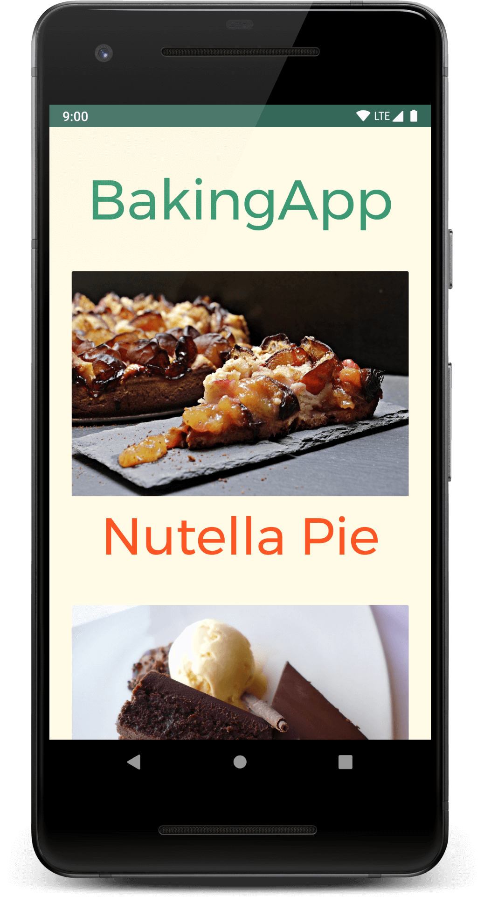

# BakingApp
Your task is to create a Android Baking App that will allow Udacity’s resident baker-in-chief, Miriam, to share her recipes with the world. You will create an app that will allow a user to select a recipe and see video-guided steps for how to complete it.

## Screenshots

## Project Overview
an app to view video recipes. You will handle media loading, verify your user interfaces with UI tests, and integrate third party libraries. You'll also provide a complete user experience with a home screen widget. This will involve finding and handling error cases, adding accessibility features, allowing for localization, adding a widget.

## Why this Project?
As a working Android developer, you often have to create and implement apps where you are responsible for designing and planning the steps you need to take to create a production-ready app. Unlike Popular Movies where we gave you an implementation guide, it will be up to you to figure things out for the Baking App.

### General App Usage
-    App should display recipes from provided network resource.
-    App should allow navigation between individual recipes and recipe steps.
-    App uses RecyclerView and can handle recipe steps that include videos or images.
-    App conforms to common standards found in the Android Nanodegree General Project Guidelines.

### Components and Libraries
-    Application uses Master Detail Flow to display recipe steps and navigation between them.
-    Application uses Exoplayer to display videos.
-    Application properly initializes and releases video assets when appropriate.
-    Application should properly retrieve media assets from the provided network links. It should properly handle network requests.
-    Application makes use of Espresso to test aspects of the UI.
-    Application sensibly utilizes a third-party library to enhance the app's features. That could be helper library to interface with Content Providers if you choose to store the recipes, a UI binding library to avoid writing findViewById a bunch of times, or something similar.

## Libraries
*   [AndroidX](https://developer.android.com/jetpack/androidx/) - Previously known as 'Android support Library'
*   [ExoPlayer](https://github.com/google/ExoPlayer) An extensible media player for Android
*   [Espresso](https://developer.android.com/training/testing/espresso/) Use Espresso to write concise, beautiful, and reliable Android UI tests.
*   [Glide](https://github.com/bumptech/glide) - for loading and caching images 
*   [Retrofit 2](https://github.com/square/retrofit) - Type-safe HTTP client for Android and Java by Square, Inc. 
*   [Gson](https://github.com/google/gson) - for serialization/deserialization Java Objects into JSON and back
*   [LiveData](https://developer.android.com/topic/libraries/architecture/livedata)
*   [ViewModel](https://developer.android.com/topic/libraries/architecture/viewmodel)
*   [DataBinding](https://developer.android.com/topic/libraries/data-binding/)
*   [OkHttp](https://github.com/square/okhttp)
*   [Timber](https://github.com/JakeWharton/timber)

